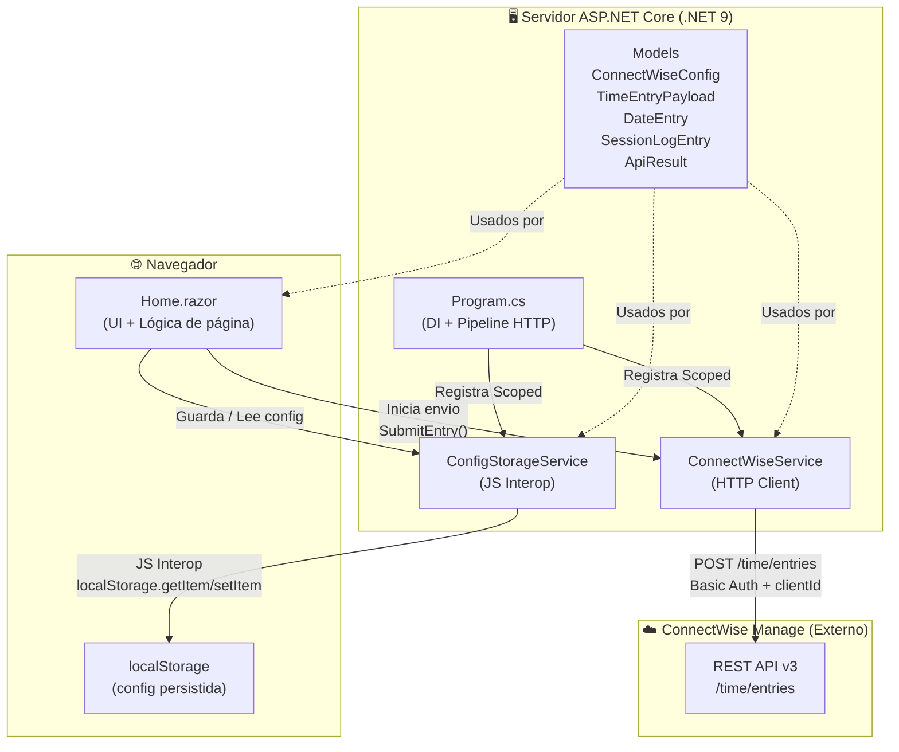

# ⏱ ConnectWise Time Entry App

Aplicación web **Blazor** (.NET 9) para registrar entradas de tiempo en ConnectWise Manage directamente desde el navegador. Soporta modo oscuro/claro, múltiples fechas por envío, y almacena la configuración en el `localStorage` del navegador (sin base de datos).

---

## 🚀 Cómo ejecutar el proyecto

### Prerequisitos

| Herramienta | Versión mínima | Verificar |
|---|---|---|
| [.NET SDK](https://dotnet.microsoft.com/download) | 9.0 | `dotnet --version` |
| Visual Studio 2022 | 17.8+ | — |
| **o** VS Code + extensión C# Dev Kit | — | — |

---

### Opción A – Línea de comandos (recomendado)

```bash
# 1. Clonar / abrir el directorio raíz del proyecto
cd c:\Users\AndresFMora\code\csapp\cwApp

# 2. Restaurar dependencias
dotnet restore

# 3. Ejecutar el proyecto servidor (cwApp)
dotnet run --project cwApp/cwApp.csproj
```

La aplicación arranca en modo desarrollo en:
- **http://localhost:5248** (HTTP)

> El puerto exacto aparece en la consola al iniciar. 
> `Now listening on: https://localhost:5248`

---

### Opción B – Visual Studio 2022

1. Abrir `cwApp.sln`
2. Asegurarse de que el proyecto de inicio sea **`cwApp`** (el servidor)
3. Presionar **F5** o el botón ▶ *https*

---

### Opción C – VS Code

1. Abrir la carpeta `cwApp/` en VS Code
2. Instalar la extensión **C# Dev Kit**
3. Abrir la paleta de comandos → **.NET: Run project**
4. Seleccionar `cwApp/cwApp.csproj`

---

### Primera vez: Configurar credenciales

Al abrir la app por primera vez (o si el `localStorage` está vacío), el modal de **Configuración** se abrirá automáticamente. Debes ingresar:

| Campo | Descripción |
|---|---|
| **Member ID** | Tu nombre de usuario en ConnectWise |
| **Public Key** | Llave pública de tu API key en CW |
| **Private Key** | Llave privada de tu API key en CW |
| **Company ID** | Identificador de la empresa (ej: `Intwo`) |
| **Site URL** | URL del servidor CW (ej: `connect.intwo.cloud`) |
| **Client ID** | GUID del Client ID registrado en CW |
| **Timezone Offset** | Diferencia UTC (ej: `-4.0` para PR, `-5.0` para COL) |

Los datos se guardan en `localStorage` del navegador y **nunca salen del equipo** hacia ningún servidor propio.

---

## 🏗️ Arquitectura del Proyecto

```
cwApp.sln
├── cwApp/                          ← Proyecto servidor (ASP.NET Core + Blazor Server)
│   ├── Program.cs                  ← Entry point, DI, pipeline HTTP
│   ├── appsettings.json            ← Configuración de logging
│   ├── Components/
│   │   ├── App.razor               ← Componente raíz Blazor
│   │   ├── Routes.razor            ← Router de la app
│   │   ├── _Imports.razor          ← Usings globales
│   │   ├── Layout/
│   │   │   ├── MainLayout.razor    ← Layout principal
│   │   │   └── MainLayout.razor.css
│   │   └── Pages/
│   │       ├── Home.razor          ← Página principal (UI + lógica)
│   │       └── Error.razor         ← Página de error
│   ├── Models/
│   │   └── TimeEntryModels.cs      ← Modelos de datos
│   └── Services/
│       ├── ConnectWiseService.cs   ← Cliente HTTP hacia ConnectWise API
│       └── ConfigStorageService.cs ← Lectura/escritura en localStorage
│
└── cwApp.Client/                   ← Proyecto cliente (Blazor WebAssembly)
    ├── Program.cs                  ← Entry point WASM
    └── _Imports.razor              ← Usings globales WASM
```

---

## 🗺️ Diagrama de Arquitectura



---

## 📦 Modelos de datos

### `ConnectWiseConfig`
Almacena la configuración de conexión al servidor CW.

| Propiedad | Tipo | Default | Descripción |
|---|---|---|---|
| `CompanyId` | `string` | `"Intwo"` | Identificador de empresa en CW |
| `PublicKey` | `string` | `""` | Llave pública API |
| `PrivateKey` | `string` | `""` | Llave privada API |
| `SiteUrl` | `string` | `"connect.intwo.cloud"` | Hostname del servidor CW |
| `MemberId` | `string` | `""` | Usuario del técnico |
| `WorkType` | `string` | `"Remote-Standard"` | Tipo de trabajo |
| `BillableOption` | `string` | `"DoNotBill"` | Opción de facturación |
| `ClientId` | `string` | GUID | Client ID registrado en CW |
| `TimezoneOffset` | `double` | `-4.0` | Offset UTC para ajuste de horario |

### `DateEntry`
Representa una entrada individual de fecha/hora para envío masivo.

| Propiedad | Tipo | Descripción |
|---|---|---|
| `Date` | `string` | Fecha en formato `yyyy-MM-dd` |
| `StartTime` | `string` | Hora inicio en formato `HH:mm` |
| `Hours` | `double` | Cantidad de horas (0.25 – 8.0) |
| `Id` | `Guid` | Identificador único para el key de Blazor |

### `ApiResult`
Resultado de cada llamada a la API de CW.

| Propiedad | Tipo | Descripción |
|---|---|---|
| `Success` | `bool` | `true` si el POST fue exitoso |
| `Message` | `string` | Mensaje descriptivo del resultado |

---

## 🔧 Servicios

### `ConnectWiseService`
- **Responsabilidad**: Enviar entradas de tiempo a ConnectWise via REST API.  
- **Endpoint**: `POST https://{SiteUrl}/v4_6_release/apis/3.0/time/entries`
- **Autenticación**: `Basic Auth` — Base64 de `{CompanyId}+{PublicKey}:{PrivateKey}` + header `clientId`
- **Ajuste de Timezone**: Convierte la hora local usando `TimezoneOffset` antes de enviar al servidor.

### `ConfigStorageService`
- **Responsabilidad**: Persistir y recuperar la configuración del usuario usando `localStorage` del browser.
- **Mecanismo**: JS Interop (IJSRuntime) → `localStorage.getItem` / `localStorage.setItem`
- **Claves guardadas**: `cw_company_id`, `cw_public_key`, `cw_private_key`, `cw_site_url`, `cw_member_id`, `cw_work_type`, `cw_billable_option`, `cw_client_id`, `cw_timezone_offset`

---

## 🖥️ Flujo de la Aplicación

```
Inicio
  │
  ▼
OnInitializedAsync()
  ├─ Calcula rango de fechas permitido (mes anterior → hoy)
  ├─ Crea primera DateEntry por defecto
  └─ Carga configuración desde localStorage
        │
        ├── Config incompleta → Abre modal de Configuración automáticamente
        └── Config completa  → La UI está lista para usar

Usuario llena formulario
  │ Ticket ID, Descripción, Billable, Flags, Fechas
  ▼
SubmitEntry()
  ├─ Valida Ticket ID, Descripción y DateEntries
  └─ Por cada DateEntry:
        │
        ├── Parsea fecha y hora inicio
        ├── Llama ConnectWiseService.PostTimeEntryAsync()
        │     └─ POST /time/entries con todos los datos
        ├── Éxito  → AddLog(✓), incrementa successCount
        └── Error  → AddLog(✗), incrementa errorCount

Al finalizar todas las fechas
  ├── Todo OK     → Snackbar verde + reset del formulario
  ├── Parcial     → Snackbar amarillo
  └── Todo error  → Snackbar rojo
```

---

## 🎨 Características de la UI

| Característica | Descripción |
|---|---|
| **Modo Oscuro/Claro** | Toggle con botón 🌙/☀️ en el header |
| **Multi-fecha** | Se pueden agregar N fechas al mismo ticket en un solo envío |
| **Session Log** | Panel de historial de entradas registradas en la sesión actual |
| **Snackbar** | Notificaciones temporales (3.5 s) de éxito / error / warning |
| **Modal de Config** | Formulario con secciones básicas y avanzadas + toggle "mostrar/ocultar" contraseñas |
| **Validación** | Validación de Ticket ID, descripción y rango de horas (0.25–8h) antes de enviar |

---

## 🛠️ Stack Tecnológico

| Capa | Tecnología |
|---|---|
| Framework | .NET 9 / ASP.NET Core |
| UI | Blazor (Render Mode: Interactive Server) |
| Cliente WASM | Blazor WebAssembly (cwApp.Client) |
| Estilos | CSS puro (scoped + global) |
| HTTP Client | `IHttpClientFactory` + `HttpClient` |
| Persistencia | Browser `localStorage` via JS Interop |
| API Externa | ConnectWise Manage REST API v3 |

---

## 📋 Notas adicionales

- **Sin base de datos**: toda la configuración vive en el `localStorage` del navegador del usuario.
- **Sin login propio**: la autenticación es delegada 100% a las API Keys de ConnectWise.
- El modo WASM (`cwApp.Client`) está configurado como proyecto hijo pero la página principal `Home.razor` corre en modo **InteractiveServer** (SignalR), no en el cliente WASM.
- Para producción, se recomienda configurar HTTPS con un certificado válido y ajustar las restricciones de CORS si fuera necesario.
