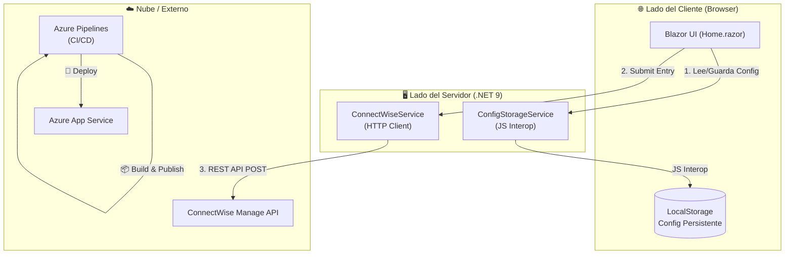

# ⏱ ConnectWise Time Entry App

[](https://dotnet.microsoft.com/download/dotnet/9.0)
[](https://dotnet.microsoft.com/apps/aspnet/web-apps/blazor)
[](azure-pipelines.yml)

Una aplicación web moderna y ligera construida con **Blazor (.NET 9)** diseñada para optimizar el registro de entradas de tiempo en **ConnectWise Manage**. Permite a los consultores registrar múltiples fechas y entradas para un mismo ticket de forma masiva, directamente desde el navegador.

---

## ✨ Características Principales

- 📁 **Registro Masivo**: Agregue múltiples entradas de tiempo a un solo ticket en una sola operación.
- 🌓 **Modo Oscuro/Claro**: Interfaz adaptativa para cualquier preferencia visual.
- 🔒 **Privacidad Primero**: Toda la configuración se almacena localmente en el navegador (`localStorage`). **Sin base de datos centralizada**.
- 🚀 **Validaciones en Tiempo Real**: Prevención de errores en Ticket ID, descripción y rangos de horas.
- 📋 **Log de Sesión**: Historial visual de las operaciones realizadas durante la sesión actual.
- 🛠️ **Configuración Flexible**: Soporte para Timezone Offsets y múltiples opciones de facturación.

---

## 🏗️ Arquitectura del Sistema

El proyecto utiliza un modelo de **Blazor Web App** con modos de renderizado interactivos (Server + WebAssembly).

### Estructura de la Solución
```text
cwApp.sln
├── cwApp/                          ← Proyecto Servidor (ASP.NET Core)
│   ├── Components/                 ← UI (Home, Pages, Layout)
│   ├── Services/                   ← Lógica (ConnectWise API, Storage)
│   └── Program.cs                  ← Configuración de DI y Pipeline
└── cwApp.Client/                   ← Proyecto Cliente (WASM Integration)
```

### Flujo de Operación


---

## 🛠️ Stack Tecnológico

| Capa | Tecnología | Propósito |
| :--- | :--- | :--- |
| **Framework** | .NET 9 | Base de la aplicación moderna |
| **Frontend** | Blazor Server / WASM | UI Reactiva e interactiva de alto rendimiento |
| **Estilos** | CSS Moderno | Diseño premium y responsivo |
| **Persistencia** | Web Storage API | Almacenamiento seguro en el cliente (Privacidad) |
| **CI/CD** | Azure DevOps | Automatización de construcción y despliegue continuo |
| **Infraestructura** | Azure App Service | Hosting escalable en la nube (Linux) |

---

## 🚀 Guía de Inicio Rápido

### Prerrequisitos
- [.NET 9.0 SDK](https://dotnet.microsoft.com/download/dotnet/9.0)
- Visual Studio 2022 o VS Code con C# Dev Kit.

### Ejecución Local
1. Clone el repositorio.
2. Navegue al directorio raíz.
3. Ejecute el siguiente comando:
   ```bash
   dotnet run --project cwApp/cwApp.csproj
   ```
4. Abra `http://localhost:5248` en su navegador.

### Configuración Inicial
Al iniciar, deberá configurar sus credenciales de ConnectWise (Member ID, API Keys, etc.). Estos datos **se guardan únicamente en su equipo** y se utilizan para firmar las peticiones a la API oficial de ConnectWise.

---

## 🔄 Pipeline de CI/CD (DevOps)

El proyecto cuenta con una integración profesional mediante **Azure Pipelines** (`azure-pipelines.yml`):

1. **Etapa de Build**: 
   - Restaura dependencias NuGet.
   - Compila la solución en modo `Release`.
   - Publica los artefactos de la aplicación Blazor optimizados.
2. **Etapa de Deploy**:
   - Se activa automáticamente al hacer push a la rama `main`.
   - Despliega la aplicación directamente en **Azure App Service (Linux)**.
   - Utiliza variables de entorno seguras gestionadas en Azure DevOps.

---

## 🔒 Privacidad y Seguridad

- **Sin Servidor Intermedio**: La aplicación actúa como un puente directo entre su navegador y ConnectWise.
- **Credenciales Efímeras**: Sus llaves privadas viven en su navegador. No se envían a analíticas ni se guardan en logs del servidor.
- **Comunicación Segura**: Todas las llamadas a la API de ConnectWise utilizan cifrado TLS y autenticación Basic Auth conforme a los estándares de la industria.

---

## 📝 Notas de Versión
- Soporte completo para .NET 9 Interactivity Service.
- Implementación de modo interactivo dinámico (Auto).
- Soporte para múltiples entradas de tiempo por ticket.
- Integración nativa con Azure DevOps para despliegue continuo.

---
*Desarrollado para optimizar el flujo de trabajo en ConnectWise.*
